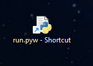
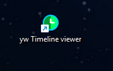

[Home](..) > [yw Timeline viewer help](index.md) > Preparations

---

# Preparations

## Setting up the program

The actual installation of the timeline viewer is simple and straightforward.
The installation program automatically creates an installation directory,
copies everything necessary into it, and generates a start file named
**run.pyw** adapted for the respective computer, which must be called
in order to start the application.

The necessary manual work consists of linking this start file to the
desktop and, if desired, assigning a program icon to the link.

For this, you can open the installation directory via a button 
in the setup script's messaging window. 

---

**Hint**

- Under Windows, the installation directory is `.yw_tlview` in you user profile, 
e.g. `C:\Users\username\.yw_tlview`.

--- 

### Creating a desktop shortcut

- Under Windows, you can drag and drop the **run.pyw** icon onto the Windows 
  desktop while holding down the `Alt` key.
  
  
- Optionally, you can open the shortcut's properties via right-click, 
  and change the icon. 
  For this you can select the **tlv64.ico** file in the **icons**
  folder in the installation directory. 
- Then you can rename the shortcut.

  

